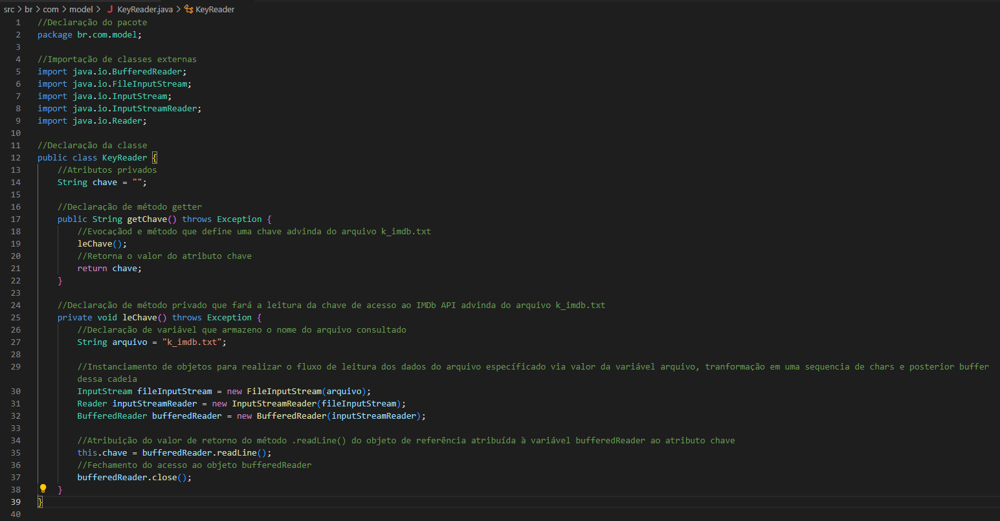
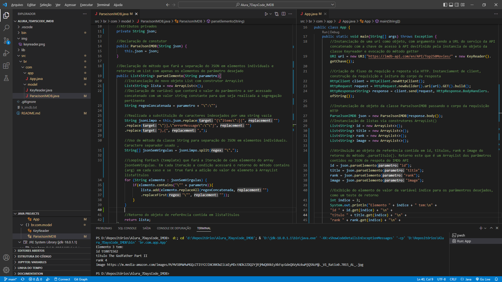
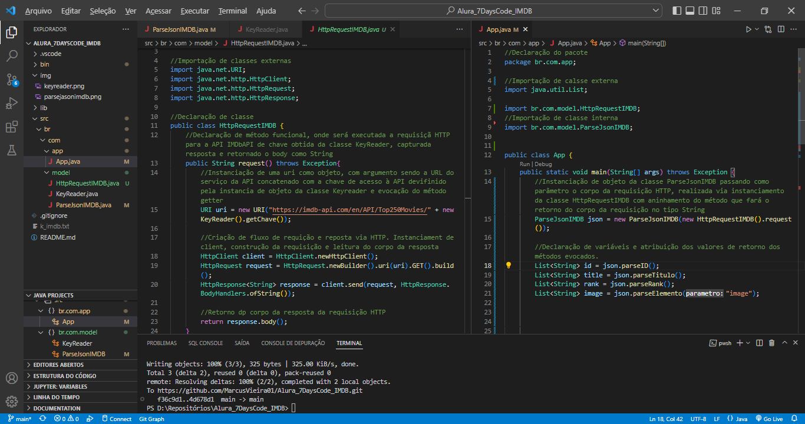
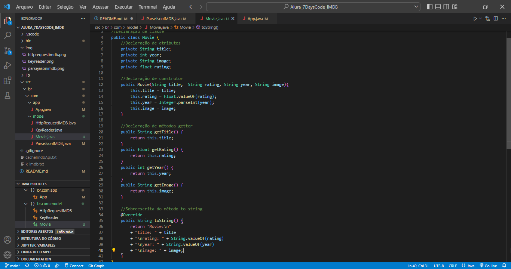
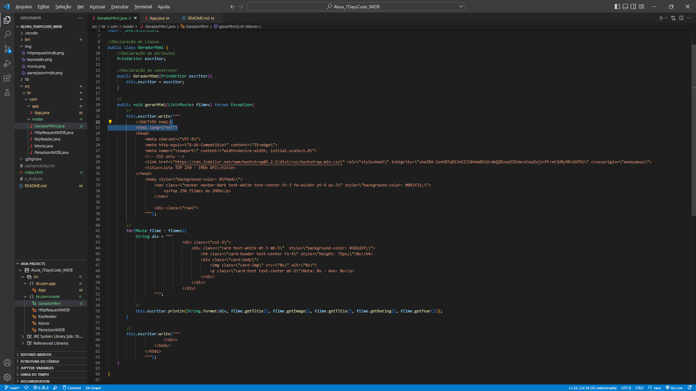
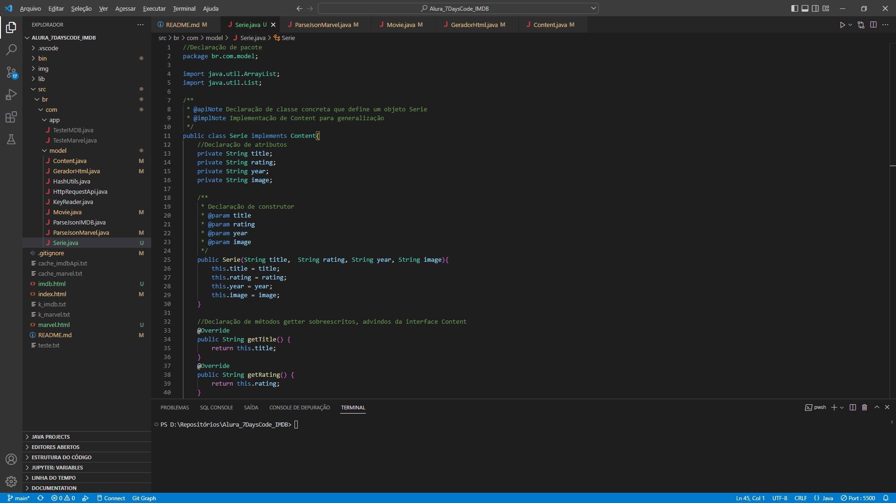

# **Projeto 7 days of code - Java e IMDb API**

## Objetivo

- Desenvolver as habilidades na linguagem Java;
- O retorno da IMDb API será via JSON;
- Criar uma aplicação que consuma a IMDb API e retorne os TOP 250 filmes;
- Esse retorno será exibido em um arquivo HTML com sua devida formatação;

### Estrutura do desafio

O desafio trata-se de um desenvolvimento orientado por 7 dias onde em cada dia é realizado um desafio:

1. Fazer o código Java consumir a API do IMDB, buscar os top 250 filmes da lista deles e imprimir o JSON correspondente no console;
2. Parsear a resposta JSON obtida a partir do IMDB para extrair as suas informações e atributos (como título, pôster, nota, etc);
3. Modelar o seu código de uma maneira melhor, pensando um pouco sobre Orientação a Objetos. Você criará uma estrutura 'Movie' (Filme) com alguns atributos, com o intuito de que cada objeto desse tipo encapsule seus próprios dados;
4. Trabalhar com a saída e gerar uma página HTML a partir da lista de objetos que você obteve anteriormente. A ideia será criar uma página HTML onde você possa ver as informações sobre o filme, incluindo o pôster e a nota;
5. Encapsular algumas das chamadas desenvolvidas até aqui em novas classes;
6. Deixar o seu código mais genérico, ou seja, preparado para receber dados de outras APIs. Para isso, você usará interfaces;
7. Ordenar a sua lista com base em diferentes atributos, utilizando a classe Collections e as interfaces Comparable e Comparator;

### Implementações

- **Dia 1:**
  - Criada classe **KeyReader** para que a leitura da chave de acesso à API seja feita de forma externa ao código. Dessa forma protege-se a chave pessoal de visualização no repositório. Em uma implementação, deve-se criar o arquivo **k_imdb.txt** e seu conteúdo deve conter a chave na primeira linha.
  
  - Na classe App foi implementada a requisição HTTP via bibliotecas HTTPClient, HTTPRequest e HTTPResponse. Dessa forma obtendo-se o JSON de resposta e o status code.

- **Dia 2:**
  - Criada a classe ParseJsonIMDB que implementa uma separação do JSON de resposta da requiusição HTTP para um parâmetro desejado, como título ou ID do filme. No desafio era requerido um método por parâmetro, porém implementado um método genérico que retorna qualquer parâmetro do JSON, apenas alterando o argumento passado na evocação do método.
  
  - Na classe App foi implementado o uso da classe ParseJsonIMDB para exibir os parâmetros desejados do elemento 3, 4º filme do TOP 250;
    - **Refatoração:** Código refatorado para separação do código de requisição HTTP na classe HttpRequestIMDB. Refatoração da classe ParseJsonIMBD com a inclusão de métodos de retorno de lista de ID, titulo e rank. O método parseElemento(arg) continua implementado e evocado na classe App para retorno das imagens;
    

- **Dia 3:**
  - Criação da classe Movie para definir o objeto com as características de um filme. Criada via declaração e criação de novo arquivo, não usando a declaração via Record Class. Foi interpretado que a abstração via Record Classes geraria acoplamento incoerente, devido sua declaração estar dentro da classe App e dessa forma a classe existiria apenas na execução da classe App e não no contexto total do projeto.
  
  - Refatoração da classe ParsonJsonIMDB com a alteração dos métodos de retorno dos elementos rate e id para os elementos rating (nota) e year (ano). Criação de anotações JavaDoc nas classes HttpRequestIMDB e KeyReader.

- **Dia 4:**
  - Criação da classe GeradorHtml que fará um arquivo HTML com código pré definido e os elementos de cada objeto Movie. Implementação da geração de HTML na classe App. Usei como base a resposta do professor Steppat que instanciou um PrintWriter. COnfiguraççoes de CSS e BootStrap são autorais;
  

- **Dia 5:**
  - Como desde o início do desafio foram geradas as classes para encapsulamento do código, esse desafio foi concluído automáticamente, sem necessidade de refatoração;

- **Dia 6:**
  - Criação da classe HashUtils que fará a elaboração de uma hash conforme algoritmo MD5, para uso na requisição da API Marvel. Realização de refatoramentos:
  - Refatoração da classe KeyReader para que houvesse a leitura das chaves da Marvel API e do IMDb API;
  - Refatoração da classe HttpRequestIMDB para HttpRequestAPI e implementados os métodos de requisição para IMDb API e API Marvel, assim como os lançamentos de exceções pertinentes;
  - Criação da interface Content para que possa generalizar a lista de objetos passada para o método gerarHtml() da classe GeradorHTML;
  - Criada classe ParseJsonMarvel para que realize o parseamento dos elementos title, year, rating e thumbnail do corpo de retorno da API Marvel;
  - Criada abstração de séries com a classe Serie;
  - Implementação da classe Main que fará a chamada da lógica da criação dos arquivos .html com as listagens do TOP 250 Filmes do IMDb e das 20 Séries da Marvel;
  - Inclusão de JavaDOCs em todas as classes do pacote model;
  

- **Dia 7:**
  - Não foi realizada a implementação da classificação;
  - Refatorado o index.html para que componha uma página HTML completa;
