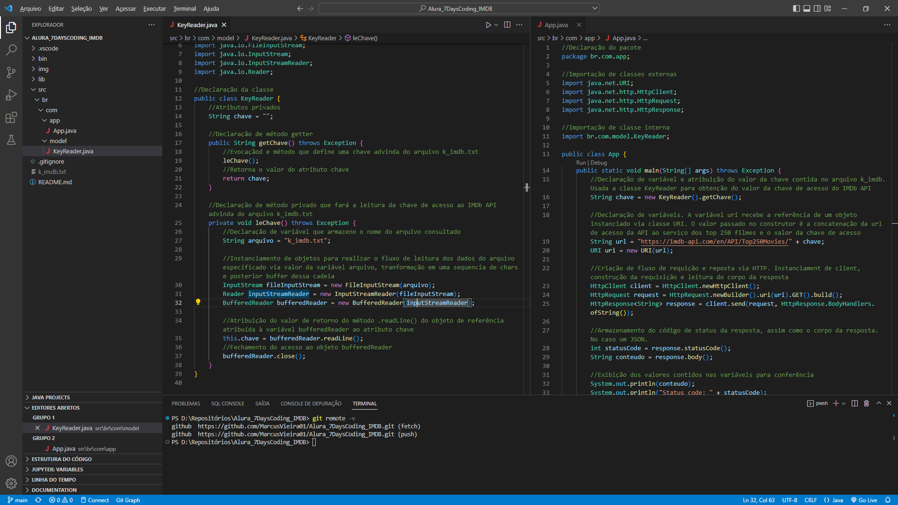

# Projeto 7 days of code - Java e IMDb API

## Objetivo

* Desenvolver as habilidades na linguagem Java;
* Criar uma aplicação que consuma a IMDb API e retorne os TOP 250 filmes;
* Esse retorno será exibido em um arquivo HTML com sua devida formatação;
* O retorno da IMDb API será via JSON;

## Estrutura do desafio

O desafio trata-se de um desenvolvimento orientado por 7 dias onde em cada dia é realizado um desafio:

1. Fazer o código Java consumir a API do IMDB, buscar os top 250 filmes da lista deles e imprimir o JSON correspondente no console;
2. Parsear a resposta JSON obtida a partir do IMDB para extrair as suas informações e atributos (como título, pôster, nota, etc);
3. Modelar o seu código de uma maneira melhor, pensando um pouco sobre Orientação a Objetos. Você criará uma estrutura 'Movie' (Filme) com alguns atributos, com o intuito de que cada objeto desse tipo encapsule seus próprios dados;
4. Trabalhar com a saída e gerar uma página HTML a partir da lista de objetos que você obteve anteriormente. A ideia será criar uma página HTML onde você possa ver as informações sobre o filme, incluindo o pôster e a nota;
5. Encapsular algumas das chamadas desenvolvidas até aqui em novas classes;
6. Deixar o seu código mais genérico, ou seja, preparado para receber dados de outras APIs. Para isso, você usará interfaces;
7. Ordenar a sua lista com base em diferentes atributos, utilizando a classe Collections e as interfaces Comparable e Comparator;

## Implementações

* **Dia 1:** Criada classe **KeyReader** para que a leitura da chave de acesso à API seja feita de forma externa ao código. Dessa forma protege-se a chave pessoal de visualização no repositório. Em uma implementação, deve-se criar o arquivo **k_imdb.txt** e seu conteúdo deve conter a chave na primeira linha.

Na classe App foi implementada a requisição HTTP via bibliotecas HTTPClient, HTTPRequest e HTTPResponse. Dessa forma obtendo-se o JSON de resposta e o status code.

* **Dia 2:** Criada a classe ParseJsonIMDB que implementa uma separação do JSON de resposta da requiusição HTTP para um parâmetro desejado, como título ou ID do filme. No desafio era requerido um método por parâmetro, porém implementado um método genérico que retorna qualquer parâmetro do JSON, apenas alterando o argumento passado na evocação do método.

Na classe App foi implementado o uso da classe ParseJsonIMDB para exibir os parâmetros desejados do elemento 3, 4º filme do TOP 250.

* **Dia 3:**
